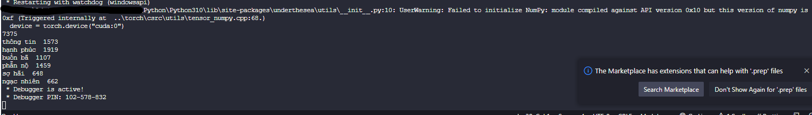

# This is my machine learning project

In this project, I train some comments on facebook posts for sentiment analysis. Don't get confused with some files that has similar content and you don't know what to do with it.

## Just focus on these:

### crawl.py
This file simulate a bot goes into the browser and access facebook posts, then crawl comments.
This must be run first.

### processing.py
After you crawl the comments, this file will process the comments and send them to the models

### app.py
This is our api file, it send the data to angular front end.

### linear_classifier.pkl, naive_bayes.pkl, lstm_model.h5
These files for saving models that you trained.

### datacmt2.txt
Where data came from.

### chromedriver.exe
Simulate the browser.

## Models that I used to train
* Naive Bayes
* LSTM
* Linear

## Commands

1. Run *python app.py*. If it has error, do
2. Run *pip install "package that you miss"*
3. Then run *python app.py*

***note: the word "python" in commands above is not force. It depends on when you set up python environment in your pc. Some people use py, some use python***

4. First site 
